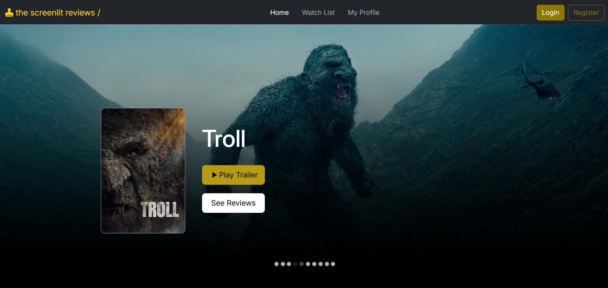
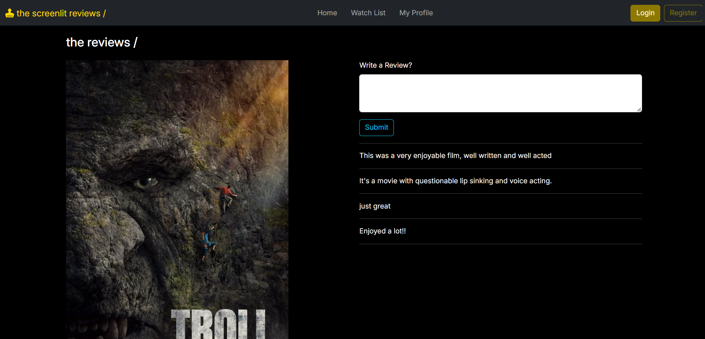

# Screenlit - Movie Review Platform

A full-stack web application where users can browse, view, and add movie reviews. Built with a **React** frontend and a **Spring Boot** backend, using **MongoDB** for data storage.

## Features ⚡

- Browse movies and watch their trailers
- Read reviews from other users
- Add your own reviews for movies

## Tech Stack 🔨

### Frontend
- **React.js**

### Backend
- **Spring Boot**
- **MongoDB** as the database

## Installation and Setup
